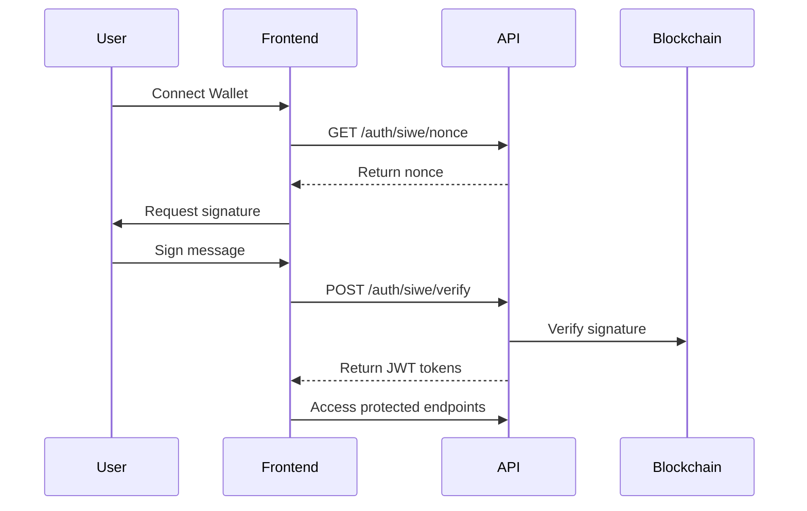
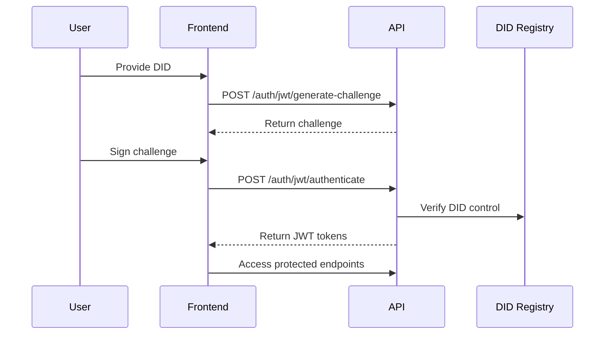

# Authentication API Documentation

## Overview

The Docu API supports two authentication methods:
1. **SIWE (Sign-In with Ethereum)** - Primary method for Web3 authentication
2. **JWT Authentication** - Traditional authentication with DID verification

Both methods provide secure access to protected endpoints and maintain user sessions.

## Authentication Flow

### SIWE Authentication Flow



### JWT Authentication Flow



## SIWE Endpoints

### Generate Nonce

Generate a unique nonce for SIWE authentication.

**Endpoint**: `GET /api/v1/auth/siwe/nonce`

**Query Parameters**:
| Parameter | Type | Required | Description |
|-----------|------|----------|-------------|
| address | string | Yes | Ethereum wallet address |

**Response**:
```json
{
  "success": true,
  "data": {
    "nonce": "8digit-random-nonce",
    "expiresAt": "2024-01-01T00:00:00Z"
  }
}
```

**Example Request**:
```bash
curl -X GET "http://localhost:3001/api/v1/auth/siwe/nonce?address=0x742d35Cc6634C0532925a3b844Bc9e7595f6E123"
```

### Verify SIWE Message

Verify a signed SIWE message and create a session.

**Endpoint**: `POST /api/v1/auth/siwe/verify`

**Request Body**:
```json
{
  "message": "docu.io wants you to sign in with your Ethereum account:\n0x742d35Cc6634C0532925a3b844Bc9e7595f6E123\n\nSign in to Docu\n\nURI: https://docu.io\nVersion: 1\nChain ID: 1\nNonce: 12345678\nIssued At: 2024-01-01T00:00:00Z",
  "signature": "0x...",
  "address": "0x742d35Cc6634C0532925a3b844Bc9e7595f6E123"
}
```

**Response**:
```json
{
  "success": true,
  "data": {
    "accessToken": "eyJhbGciOiJIUzI1NiIs...",
    "refreshToken": "eyJhbGciOiJIUzI1NiIs...",
    "expiresIn": 900,
    "user": {
      "address": "0x742d35Cc6634C0532925a3b844Bc9e7595f6E123",
      "did": "did:ethr:0x742d35Cc6634C0532925a3b844Bc9e7595f6E123",
      "roles": ["holder"]
    }
  }
}
```

### Refresh Token

Refresh an expired access token using a valid refresh token.

**Endpoint**: `POST /api/v1/auth/siwe/refresh`

**Request Body**:
```json
{
  "refreshToken": "eyJhbGciOiJIUzI1NiIs..."
}
```

**Response**:
```json
{
  "success": true,
  "data": {
    "accessToken": "eyJhbGciOiJIUzI1NiIs...",
    "expiresIn": 900
  }
}
```

### Get Session

Get current session information.

**Endpoint**: `GET /api/v1/auth/siwe/session`

**Headers**:
```
Authorization: Bearer <access-token>
```

**Response**:
```json
{
  "success": true,
  "data": {
    "user": {
      "address": "0x742d35Cc6634C0532925a3b844Bc9e7595f6E123",
      "did": "did:ethr:0x742d35Cc6634C0532925a3b844Bc9e7595f6E123"
    },
    "session": {
      "id": "session-id",
      "createdAt": "2024-01-01T00:00:00Z",
      "expiresAt": "2024-01-01T01:00:00Z"
    }
  }
}
```

### Logout

End the current session and invalidate tokens.

**Endpoint**: `POST /api/v1/auth/siwe/logout`

**Request Body**:
```json
{
  "refreshToken": "eyJhbGciOiJIUzI1NiIs..."
}
```

**Response**:
```json
{
  "success": true,
  "message": "Successfully logged out"
}
```

### Get Profile

Get authenticated user's profile information.

**Endpoint**: `GET /api/v1/auth/siwe/profile`

**Headers**:
```
Authorization: Bearer <access-token>
```

**Response**:
```json
{
  "success": true,
  "data": {
    "address": "0x742d35Cc6634C0532925a3b844Bc9e7595f6E123",
    "did": "did:ethr:0x742d35Cc6634C0532925a3b844Bc9e7595f6E123",
    "roles": ["holder", "issuer"],
    "profile": {
      "displayName": "User Name",
      "avatar": "ipfs://QmXxx...",
      "createdAt": "2024-01-01T00:00:00Z"
    }
  }
}
```

### Get DID Info

Get DID information for the authenticated user.

**Endpoint**: `GET /api/v1/auth/siwe/did-info`

**Headers**:
```
Authorization: Bearer <access-token>
```

**Response**:
```json
{
  "success": true,
  "data": {
    "did": "did:ethr:0x742d35Cc6634C0532925a3b844Bc9e7595f6E123",
    "isActive": true,
    "publicKey": "0x04...",
    "controller": "0x742d35Cc6634C0532925a3b844Bc9e7595f6E123",
    "createdAt": "2024-01-01T00:00:00Z",
    "updatedAt": "2024-01-01T00:00:00Z"
  }
}
```

## JWT Endpoints

### Generate Challenge

Generate a challenge for DID authentication.

**Endpoint**: `POST /api/v1/auth/jwt/generate-challenge`

**Request Body**:
```json
{
  "did": "did:ethr:0x742d35Cc6634C0532925a3b844Bc9e7595f6E123"
}
```

**Response**:
```json
{
  "success": true,
  "data": {
    "challenge": "random-challenge-string",
    "expiresAt": "2024-01-01T00:05:00Z"
  }
}
```

### Authenticate

Authenticate by verifying a signed challenge.

**Endpoint**: `POST /api/v1/auth/jwt/authenticate`

**Request Body**:
```json
{
  "did": "did:ethr:0x742d35Cc6634C0532925a3b844Bc9e7595f6E123",
  "challenge": "random-challenge-string",
  "signature": "0x..."
}
```

**Response**:
```json
{
  "success": true,
  "data": {
    "accessToken": "eyJhbGciOiJIUzI1NiIs...",
    "refreshToken": "eyJhbGciOiJIUzI1NiIs...",
    "expiresIn": 900,
    "user": {
      "did": "did:ethr:0x742d35Cc6634C0532925a3b844Bc9e7595f6E123",
      "address": "0x742d35Cc6634C0532925a3b844Bc9e7595f6E123"
    }
  }
}
```

### Check Authentication

Check if the current JWT token is valid.

**Endpoint**: `GET /api/v1/auth/jwt/check`

**Headers**:
```
Authorization: Bearer <access-token>
```

**Response**:
```json
{
  "success": true,
  "data": {
    "authenticated": true,
    "user": {
      "did": "did:ethr:0x742d35Cc6634C0532925a3b844Bc9e7595f6E123",
      "address": "0x742d35Cc6634C0532925a3b844Bc9e7595f6E123"
    }
  }
}
```

### Refresh JWT Token

Refresh an expired JWT access token.

**Endpoint**: `POST /api/v1/auth/jwt/refresh`

**Headers**:
```
Authorization: Bearer <access-token>
```

**Request Body**:
```json
{
  "refreshToken": "eyJhbGciOiJIUzI1NiIs..."
}
```

**Response**:
```json
{
  "success": true,
  "data": {
    "accessToken": "eyJhbGciOiJIUzI1NiIs...",
    "expiresIn": 900
  }
}
```

### Verify Controller

Verify that an address controls a DID.

**Endpoint**: `POST /api/v1/auth/jwt/verify-controller`

**Request Body**:
```json
{
  "did": "did:ethr:0x742d35Cc6634C0532925a3b844Bc9e7595f6E123",
  "address": "0x742d35Cc6634C0532925a3b844Bc9e7595f6E123"
}
```

**Response**:
```json
{
  "success": true,
  "data": {
    "isController": true,
    "did": "did:ethr:0x742d35Cc6634C0532925a3b844Bc9e7595f6E123",
    "controller": "0x742d35Cc6634C0532925a3b844Bc9e7595f6E123"
  }
}
```

### Get DID for Address

Get the DID associated with an Ethereum address.

**Endpoint**: `GET /api/v1/auth/jwt/address/:address`

**Parameters**:
| Parameter | Type | Required | Description |
|-----------|------|----------|-------------|
| address | string | Yes | Ethereum address |

**Response**:
```json
{
  "success": true,
  "data": {
    "did": "did:ethr:0x742d35Cc6634C0532925a3b844Bc9e7595f6E123",
    "address": "0x742d35Cc6634C0532925a3b844Bc9e7595f6E123",
    "isActive": true
  }
}
```

### Check DID Active Status

Check if a DID is currently active.

**Endpoint**: `GET /api/v1/auth/jwt/did/:did/active`

**Parameters**:
| Parameter | Type | Required | Description |
|-----------|------|----------|-------------|
| did | string | Yes | Decentralized Identifier |

**Response**:
```json
{
  "success": true,
  "data": {
    "did": "did:ethr:0x742d35Cc6634C0532925a3b844Bc9e7595f6E123",
    "isActive": true,
    "deactivatedAt": null
  }
}
```

### Get JWT DID Info

Get DID information for the JWT authenticated user.

**Endpoint**: `GET /api/v1/auth/jwt/did-info`

**Headers**:
```
Authorization: Bearer <access-token>
```

**Response**:
```json
{
  "success": true,
  "data": {
    "did": "did:ethr:0x742d35Cc6634C0532925a3b844Bc9e7595f6E123",
    "isActive": true,
    "publicKey": "0x04...",
    "controller": "0x742d35Cc6634C0532925a3b844Bc9e7595f6E123",
    "metadata": {
      "createdAt": "2024-01-01T00:00:00Z",
      "updatedAt": "2024-01-01T00:00:00Z"
    }
  }
}
```

## Protected Routes

### Access Protected Endpoint

Example of accessing a protected endpoint that works with both auth methods.

**Endpoint**: `GET /api/v1/auth/protected/profile`

**Headers**:
```
Authorization: Bearer <access-token>
```

**Response**:
```json
{
  "success": true,
  "data": {
    "message": "Access granted",
    "authMethod": "siwe", // or "jwt"
    "user": {
      "address": "0x742d35Cc6634C0532925a3b844Bc9e7595f6E123",
      "did": "did:ethr:0x742d35Cc6634C0532925a3b844Bc9e7595f6E123"
    }
  }
}
```

## Token Management

### Token Types

1. **Access Token**
   - Short-lived (15 minutes default)
   - Used for API requests
   - Contains user identity and permissions

2. **Refresh Token**
   - Long-lived (7 days default)
   - Used to obtain new access tokens
   - Stored securely and rotated on use

### Token Payload Structure

```json
{
  "sub": "did:ethr:0x742d35Cc6634C0532925a3b844Bc9e7595f6E123",
  "address": "0x742d35Cc6634C0532925a3b844Bc9e7595f6E123",
  "authMethod": "siwe",
  "roles": ["holder", "issuer"],
  "iat": 1704067200,
  "exp": 1704068100
}
```

## Security Considerations

### Rate Limiting

- Authentication endpoints: 5 requests per minute per IP
- Token refresh: 10 requests per hour per user
- Protected endpoints: 100 requests per minute per user

### Best Practices

1. **Always use HTTPS** in production
2. **Store tokens securely** in the frontend (httpOnly cookies preferred)
3. **Implement token rotation** for refresh tokens
4. **Monitor for suspicious activity** (multiple failed attempts)
5. **Use appropriate token expiration times**

### Common Security Headers

```http
X-Content-Type-Options: nosniff
X-Frame-Options: DENY
X-XSS-Protection: 1; mode=block
Strict-Transport-Security: max-age=31536000; includeSubDomains
```

## Error Handling

### Authentication Errors

| Error Code | HTTP Status | Description |
|------------|-------------|-------------|
| AUTH_INVALID_NONCE | 401 | Nonce is invalid or expired |
| AUTH_INVALID_SIGNATURE | 401 | Signature verification failed |
| AUTH_INVALID_TOKEN | 401 | JWT token is invalid |
| AUTH_TOKEN_EXPIRED | 401 | JWT token has expired |
| AUTH_INVALID_REFRESH | 401 | Refresh token is invalid |
| AUTH_USER_NOT_FOUND | 404 | User or DID not found |
| AUTH_RATE_LIMITED | 429 | Too many authentication attempts |

### Error Response Format

```json
{
  "success": false,
  "error": {
    "code": "AUTH_INVALID_TOKEN",
    "message": "The provided authentication token is invalid",
    "details": {
      "reason": "Token signature verification failed"
    }
  }
}
```

## Development Tools

### Testing Authentication

#### SIWE Testing

```bash
# Generate nonce
curl -X GET "http://localhost:3001/api/v1/auth/siwe/nonce?address=0x742d35Cc6634C0532925a3b844Bc9e7595f6E123"

# Verify (requires signed message)
curl -X POST "http://localhost:3001/api/v1/auth/siwe/verify" \
  -H "Content-Type: application/json" \
  -d '{
    "message": "...",
    "signature": "0x...",
    "address": "0x742d35Cc6634C0532925a3b844Bc9e7595f6E123"
  }'
```

#### JWT Testing

```bash
# Generate challenge
curl -X POST "http://localhost:3001/api/v1/auth/jwt/generate-challenge" \
  -H "Content-Type: application/json" \
  -d '{
    "did": "did:ethr:0x742d35Cc6634C0532925a3b844Bc9e7595f6E123"
  }'

# Authenticate (requires signed challenge)
curl -X POST "http://localhost:3001/api/v1/auth/jwt/authenticate" \
  -H "Content-Type: application/json" \
  -d '{
    "did": "did:ethr:0x742d35Cc6634C0532925a3b844Bc9e7595f6E123",
    "challenge": "...",
    "signature": "0x..."
  }'
```

### Development Authentication (Non-Production)

For development environments, additional endpoints are available:

**Endpoint**: `GET /api/v1/auth/dev/mock-login`

**Query Parameters**:
| Parameter | Type | Required | Description |
|-----------|------|----------|-------------|
| address | string | Yes | Ethereum address to mock |

**Response**:
```json
{
  "success": true,
  "data": {
    "accessToken": "eyJhbGciOiJIUzI1NiIs...",
    "refreshToken": "eyJhbGciOiJIUzI1NiIs...",
    "message": "Development login successful"
  }
}
```

## Migration Guide

### Migrating from JWT to SIWE

1. **Update Frontend**:
   - Integrate wallet connection (wagmi, ethers.js)
   - Replace login form with wallet signature flow

2. **Update Token Storage**:
   - Continue using same token storage mechanism
   - Token format remains compatible

3. **Gradual Migration**:
   - Both auth methods work simultaneously
   - Migrate users progressively
   - Deprecate JWT auth after full migration

### Backward Compatibility

The API maintains backward compatibility by:
- Supporting both authentication methods
- Using unified token format
- Sharing session management
- Common user data structure