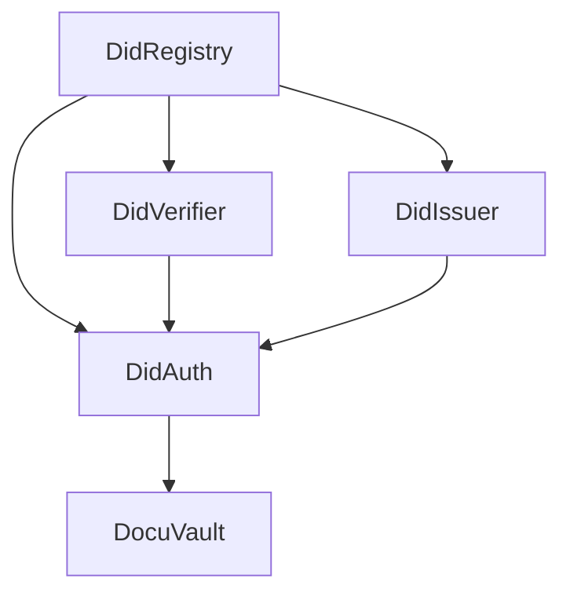

# Docu Smart Contract Deployment Guide

## Overview

This guide provides detailed instructions for deploying the Docu smart contracts to Sepolia testnet and mainnet. The deployment process includes comprehensive pre-flight checks, beautiful CLI interfaces, and automated verification.

## Table of Contents

1. [Prerequisites](#prerequisites)
2. [Environment Setup](#environment-setup)
3. [Deployment Workflow](#deployment-workflow)
4. [Post-Deployment](#post-deployment)
5. [Troubleshooting](#troubleshooting)
6. [Gas Optimization](#gas-optimization)
7. [Security Considerations](#security-considerations)

## Prerequisites

### Required Tools

- Node.js v18+ and pnpm
- Git
- A code editor (VS Code recommended)

### Required Accounts

1. **Alchemy Account** - [Sign up here](https://dashboard.alchemy.com/)
2. **Etherscan Account** - [Sign up here](https://etherscan.io/register)
3. **MetaMask or Hardware Wallet** - For deployment

### Required Funds

- **Sepolia Testnet**: ~0.5 ETH (get from [faucets](https://sepoliafaucet.com/))
- **Mainnet**: ~0.2 ETH (depending on gas prices)

## Environment Setup

### 1. Clone and Install

```bash
# Clone the repository
git clone https://github.com/your-org/docu-vault.git
cd docu-vault

# Install dependencies
pnpm install

# Navigate to contracts
cd apps/contract
```

### 2. Configure Environment Variables

```bash
# Copy the example environment file
cp .env.example .env

# Edit .env with your values
```

Required environment variables:

```env
# RPC Provider
ALCHEMY_API_KEY=your_alchemy_api_key
SEPOLIA_URL=https://eth-sepolia.g.alchemy.com/v2/${ALCHEMY_API_KEY}

# Deployment Wallet (NEVER commit!)
TESTNET_PRIVATE_KEY=0x...your_private_key
DEPLOYER_ADDRESS=0x...your_address

# Contract Verification
ETHERSCAN_API_KEY=your_etherscan_api_key

# Auto-verify after deployment
AUTO_VERIFY=true
CONFIRMATION_BLOCKS=6
```

## Deployment Workflow

### Step 1: Run Pre-deployment Checklist

```bash
npm run deploy:checklist
```

This comprehensive checklist verifies:
- ✅ Network configuration
- ✅ Environment variables
- ✅ Account balance
- ✅ Contract compilation
- ✅ Gas prices
- ✅ Dependencies

### Step 2: Compile and Optimize Contracts

```bash
# Clean and compile
npm run build

# Check contract sizes
npm run size
```

Expected output:
```
┌─────────────────────┬────────────┬───────────┐
│ Contract Name       │ Size (KB)  │ Change    │
├─────────────────────┼────────────┼───────────┤
│ DidRegistry         │ 12.45      │           │
│ DidAuth             │ 18.23      │           │
│ DidIssuer           │ 14.67      │           │
│ DidVerifier         │ 13.89      │           │
│ DocuVault           │ 22.14      │           │
└─────────────────────┴────────────┴───────────┘
```

### Step 3: Test on Local Network

```bash
# Terminal 1: Start local node
npm run dev:contract

# Terminal 2: Deploy locally
npm run deploy

# Verify deployment
npm run deploy:verify --network localhost
```

### Step 4: Deploy to Sepolia

```bash
npm run deploy:sepolia
```

The deployment script features:
- 🎨 Beautiful ASCII art banner
- 📊 Real-time progress tracking
- ⏱️ Spinner animations
- 📈 Gas usage tracking
- ✅ Automatic verification

### Step 5: Verify Deployment

```bash
npm run deploy:verify --network sepolia
```

This will:
- Check contract bytecode
- Verify dependencies
- Test basic interactions
- Confirm role setup

## Post-Deployment

### 1. Set Up Roles

```bash
# Configure admin roles
npm run setup:roles

# Register initial admin
npm run register:admin --network sepolia
```

### 2. Register System Participants

```bash
# Register issuers
npm run register:issuer --network sepolia

# Register verifiers  
npm run register:verifier --network sepolia

# Verify all roles
npm run verify:roles --network sepolia
```

### 3. Update Other Services

Update the API configuration:
```env
# apps/api/.env
SEPOLIA_DID_REGISTRY_ADDRESS=0x...
SEPOLIA_DID_AUTH_ADDRESS=0x...
SEPOLIA_DID_ISSUER_ADDRESS=0x...
SEPOLIA_DID_VERIFIER_ADDRESS=0x...
SEPOLIA_DOCU_VAULT_ADDRESS=0x...
```

Update the frontend configuration:
```typescript
// apps/web/src/config/contracts.ts
export const CONTRACT_ADDRESSES = {
  sepolia: {
    DidRegistry: "0x...",
    DidAuth: "0x...",
    DidIssuer: "0x...",
    DidVerifier: "0x...",
    DocuVault: "0x..."
  }
};
```

## Contract Architecture

### Deployment Order

Contracts must be deployed in this specific order due to dependencies:



### Contract Descriptions

| Contract | Purpose | Dependencies |
|----------|---------|--------------|
| **DidRegistry** | Manages DID registration and resolution | None |
| **DidVerifier** | Handles verifier role management | DidRegistry |
| **DidIssuer** | Manages issuer credentials | DidRegistry |
| **DidAuth** | Authentication and authorization | All above |
| **DocuVault** | Main document management | None (uses DidAuth) |

## Troubleshooting

### Common Issues

#### "Insufficient funds for gas"
```bash
# Check balance
cast balance $DEPLOYER_ADDRESS --rpc-url $SEPOLIA_URL

# Get testnet ETH
# Visit: https://sepoliafaucet.com/
```

#### "Nonce too low"
```bash
# Reset nonce in MetaMask
# Settings > Advanced > Clear activity tab data
```

#### "Contract size exceeds limit"
```solidity
// In hardhat.config.ts
optimizer: {
  enabled: true,
  runs: 200,  // Reduce for smaller size
}
```

#### Deployment fails midway
```bash
# Check partial deployment
cat deployments/sepolia-latest-failed.json

# Resume from failed contract
# Edit deploy script to skip completed contracts
```

### Recovery Process

If deployment fails:

1. Check saved deployment state:
```bash
ls -la deployments/
cat deployments/sepolia-latest-failed.json
```

2. Identify deployed contracts
3. Update deployment script to skip deployed contracts
4. Resume deployment

## Gas Optimization

### Estimated Gas Costs

| Contract | Gas Units | Cost @ 30 Gwei | Cost @ 100 Gwei |
|----------|-----------|----------------|-----------------|
| DidRegistry | ~1.5M | 0.045 ETH | 0.15 ETH |
| DidVerifier | ~1.2M | 0.036 ETH | 0.12 ETH |
| DidIssuer | ~1.2M | 0.036 ETH | 0.12 ETH |
| DidAuth | ~2.0M | 0.060 ETH | 0.20 ETH |
| DocuVault | ~3.0M | 0.090 ETH | 0.30 ETH |
| **Total** | **~8.9M** | **~0.27 ETH** | **~0.89 ETH** |

### Gas Saving Tips

1. **Deploy during low congestion**:
   - Check gas prices: https://etherscan.io/gastracker
   - Weekends often have lower gas

2. **Optimize contract code**:
   ```solidity
   // Use tight variable packing
   struct Document {
       uint128 id;      // Pack together
       uint128 version; // Same slot
       address owner;   // New slot
   }
   ```

3. **Batch operations**:
   - Deploy all contracts in one session
   - Set up roles in batch transactions

## Security Considerations

### Pre-deployment Security Checklist

- [ ] Private keys are secure (use hardware wallet for mainnet)
- [ ] `.env` file is in `.gitignore`
- [ ] No hardcoded values in contracts
- [ ] All tests pass
- [ ] Audit report reviewed (if applicable)

### Post-deployment Security

1. **Transfer Ownership**:
```javascript
// Transfer to multisig after deployment
await docuVault.transferOwnership(MULTISIG_ADDRESS);
```

2. **Set Up Access Controls**:
```javascript
// Restrict admin functions
await docuVault.grantRole(ADMIN_ROLE, ADMIN_ADDRESS);
await docuVault.renounceRole(ADMIN_ROLE, DEPLOYER_ADDRESS);
```

3. **Enable Monitoring**:
- Set up Etherscan email alerts
- Configure Tenderly monitoring
- Use OpenZeppelin Defender

### Emergency Procedures

If issues are discovered post-deployment:

1. **Pause contracts** (if pausable):
```javascript
await docuVault.pause();
```

2. **Notify users** via official channels
3. **Assess and fix** the issue
4. **Deploy fix** or migrate if necessary

## Mainnet Deployment

### Additional Mainnet Considerations

1. **Use hardware wallet** (Ledger/Trezor)
2. **Deploy through multisig** (Gnosis Safe)
3. **Have emergency pause plan**
4. **Monitor gas prices** closely
5. **Deploy in stages** if needed

### Mainnet Checklist

- [ ] Audit completed and issues resolved
- [ ] Testnet deployment successful for 30+ days
- [ ] Emergency procedures documented
- [ ] Team trained on emergency response
- [ ] Legal/compliance review completed
- [ ] Insurance/coverage arranged (if applicable)

## Resources

### Documentation
- [Hardhat Docs](https://hardhat.org/docs)
- [OpenZeppelin Contracts](https://docs.openzeppelin.com/contracts/)
- [Ethereum Best Practices](https://consensys.github.io/smart-contract-best-practices/)

### Tools
- [Etherscan](https://etherscan.io/)
- [Tenderly](https://tenderly.co/)
- [OpenZeppelin Defender](https://defender.openzeppelin.com/)

### Support
- GitHub Issues: [your-repo/issues](https://github.com/your-org/docu-vault/issues)
- Discord: [Join our Discord](https://discord.gg/your-discord)
- Email: support@docuvault.io

## Conclusion

Following this guide ensures a smooth, secure deployment of the Docu smart contracts. The enhanced deployment scripts provide clear feedback and error handling, making the process straightforward even for complex multi-contract deployments.

Remember: **Test thoroughly on testnet before mainnet deployment!**